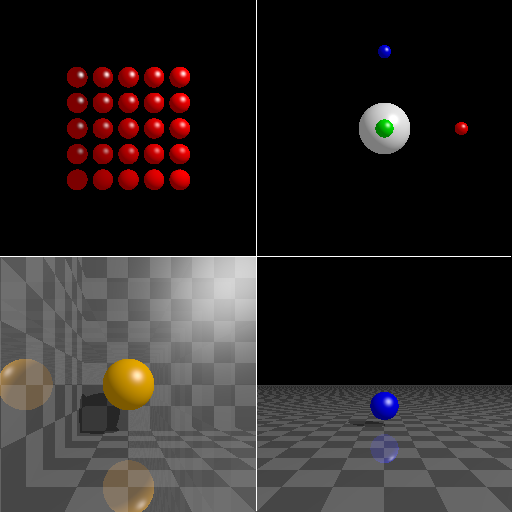

# rust-rt

This is a super simple raytracer written as a way to learn a bit of
Rust:

I make no claims at all on the style or even the correctness of the
Rust code. I'm an experienced developer, but Rust is a new language to
me, and there's obviously a great deal of depth to using it
idiomatically.

What I can say is that this codebase seems to render simple images
fairly well and quickly, and Rust made it easy to get there, even for
a newbie to the language. I look forward to using it more and
developing that more idiomatic style, and in more complex domains.

## Features

* Render planes and spheres.
* Ambient, diffuse, and specular lighting.
* Scene definitions written in Rust code.
* Generates PNG output in the sRGB color space.
* Parallelized rendering.

## Resources Used

Resources used for the graphics algorithms include at least the
following:

* The [Scratchapixel](https://www.scratchapixel.com/index.php?redirect) tutorial site.
* [Computer Graphics: Principles and Practice](https://www.amazon.com/Computer-Graphics-Principles-Practice-3rd/dp/0321399528)

For Rust itself, I heavily relied on
[Rust's own website](https://www.rust-lang.org/learn) and
excellent tooling. I'd be remiss if I didn't mention that
the quality of the diagnostic messages produced by the
compiler are second to none and very helpful.

# Performance

One of the joys of Rust is that it compiles to native code and can be
fairly easily made to run quickly. The sample scene above renders at
2048 by 2048 in 35.7 seconds on a 2009 MacBook Pro, 4.47 seconds on a
2016 MacBook Pro, and 3.4 seconds on a 2020 MacBook Air M1. That's
with no optimization or tuning - just straight naive code churning
through the math to render four million pixels.

# Potential Futures

This is a raytracer - the sky's really the limit, provided there's
enough time to get there. If you want to render some graphics, you're
better off using something else. If you want to have some fun writing
graphics code in Rust, this might not be a bad place to start.

A couple suggestions on where this could be taken:

* Additional geometry - boxes and cylinders come to mind immediately.
* Support for multiple lights in a scene.
* A text-based definition language for scenes.
* Refractive, transparent objects.

# Licensing and Copyright

Copyright (c) Michael Schaeffer

Licened under the Eclipse Public Licence v2.0, found at the root of
this repository in the [`LICENSE`](LICENSE) file.
